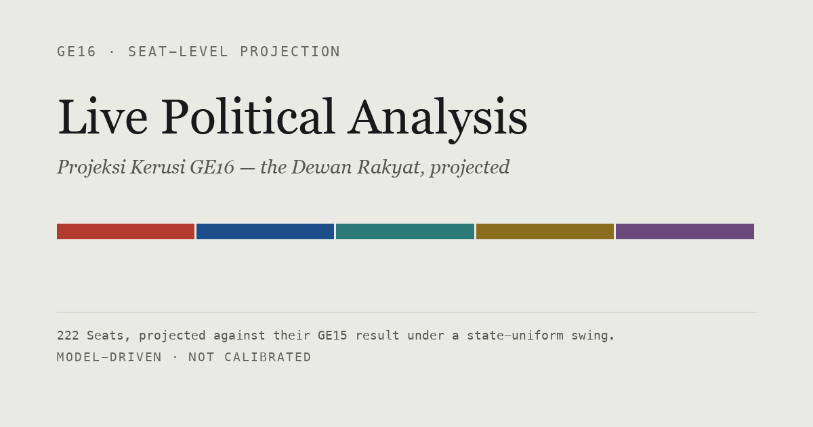
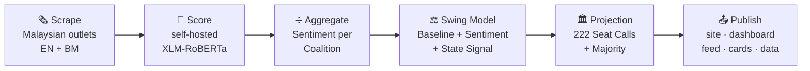

<!-- ────────────────────────────  HERO  ──────────────────────────── -->
<p align="center">
  <a href="https://politikku.my">
    
  </a>
</p>

<h1 align="center">🗳️ Live Political Analysis</h1>

<p align="center">
  <em>Malaysian political sentiment, tracked daily — projected onto the 222 Seats of the Dewan Rakyat.</em>
</p>

<p align="center">
  
</p>

<!-- ────────────────────────────  BADGES  ──────────────────────────── -->
<p align="center">
  <a href="https://github.com/IlhamKassim/politikku/actions/workflows/ci.yml"></a>
  <a href="https://politikku.my"></a>
  <a href="LICENSE"></a>
  
  
  
  <a href="https://github.com/IlhamKassim/politikku/pulls"></a>
</p>

<!-- ────────────────────────────  NAV  ──────────────────────────── -->
<p align="center">
  <a href="https://politikku.my">🌐 Live site</a> &nbsp;·&nbsp;
  <a href="https://politikku.my/app/">🗺️ Interactive map</a> &nbsp;·&nbsp;
  <a href="https://politikku.my/projection/">📊 Seat Projection</a> &nbsp;·&nbsp;
  <a href="https://politikku.my/methodology.html">📖 Methodology</a> &nbsp;·&nbsp;
  <a href="CONTEXT.md">📚 Vocabulary</a>
</p>

---

## 👋 What is this?

**Live Political Analysis** reads the news the way Malaysia does — in English *and* Bahasa Malaysia — measures the political mood every day, and turns it into a concrete answer to one question:

> **If GE16 were held on today's mood, how would the 222 Seats fall — and does the Government Coalition keep its Majority?**

It scrapes major Malaysian outlets, scores each article with a **self-hosted, open-source sentiment model** (no paid API), rolls that into a **Sentiment** reading per **Coalition**, and runs it through a **Swing Model** against every Seat's **GE15 Baseline** to produce a full **Seat-Level Projection**. The result is published every day to **[politikku.my](https://politikku.my)** — as an interactive map, one profile per MP, a live chamber, machine-readable data, and shareable cards.

And it does all of it at **zero recurring cost** by default — self-hosted model, free data sources, free hosting ([ADR 0002](docs/adr/0002-zero-cost-self-hosted-sentiment-stack.md), amended by [ADR 0007](docs/adr/0007-zero-cost-is-default-not-mandate.md)).

> [!IMPORTANT]
> This is an **independent model estimate, not an official forecast**, and the model is **not yet calibrated**. Please read [⚠️ Before you trust a number](#before-you-trust-a-number) before quoting any figure.

---

## ✨ What you get

- 🗞️ **A daily read of the room** — Sentiment per Coalition, from real Malaysian headlines in two languages.
- 🏛️ **A full Seat-Level Projection** — all 222 Seats called individually, plus the headline Majority verdict.
- 🗺️ **An interactive map** — find your Seat, see your wakil rakyat, follow the projection.
- 📤 **Open data** — the same Projection as `projection.json` / `projection.csv` for journalists and researchers.
- 🖼️ **Shareable Seat Call cards** — one clean SVG per Seat, ready to post.
- 📡 **A Return Trigger feed** — an Atom feed that fires only when something *actually* changes.
- 🔍 **Receipts for everything** — every number traces to its source; the whole method is public.

---

## 🧭 How it works

The pipeline is a straight line from a headline to a Seat Call, run fresh every day:



- **Baseline** is fixed historical fact: every Seat's GE15 (2022) result. It never moves.
- **Sentiment** is the daily signal — continuous **News Sentiment** plus periodic **Poll Calibration** from Merdeka Center.
- **Swing Model** is the hard part: it turns Sentiment into a per-Seat Swing (uniform within a state, with a **State Election Signal** blended in for the state that voted).
- **Projection** is the output: a seat count per Coalition, the Majority verdict, and the Seat-Level Projection behind both.

New here? The words in **bold** are precise terms with exact meanings — they all live in **[`CONTEXT.md`](CONTEXT.md)**. Read that first; the code uses them literally.

---

## 🚀 Quickstart

You'll need **Python 3.11+** and [`uv`](https://docs.astral.sh/uv/). From the repo root:

```sh
# 1) Install (self-hosted sentiment model + dashboard)
uv venv .venv
uv pip install --python .venv/bin/python -e ".[dev,sentiment,dashboard]"

# 2) Point Storage at a local SQLite file
export DATABASE_URL="sqlite+pysqlite:///$PWD/lpa.db"

# 3) Load the Baseline once (GE15 fact — 222 Seat Baselines)
.venv/bin/python -m lpa.baseline_loader

# 4) Run the pipeline: scrape → score → aggregate → project → store
.venv/bin/python -m lpa.pipeline
```

That last step prints the day's Sentiment and the full Projection, and stores one snapshot. Re-running the same day *corrects* that day rather than adding a second answer for it.

> 💡 The `sentiment` extra pulls `torch`, `transformers`, `sentencepiece` **and** `protobuf` — all four are needed, because the XLM-RoBERTa tokeniser fails without both `sentencepiece` *and* `protobuf` (with an error that only names the first).

### See the dashboard

```sh
# A little history makes the trend line worth looking at (SQLite-only, dev-only)
.venv/bin/python scripts/seed_dev_snapshots.py --days 14
.venv/bin/streamlit run src/lpa/dashboard.py
```

The dashboard is **read-only** — it renders whatever the pipeline last stored, and never scrapes or projects itself.

---

## 🔬 Explore each surface

<details>
<summary><strong>🧠 The pipeline internals — scraper, model, poll calibration</strong></summary>

<br>

Storage is any SQLAlchemy URL — SQLite locally, free-tier Postgres in the daily run. Without `DATABASE_URL` it writes `lpa.db` in the working directory.

The Baseline must be loaded before the pipeline will run; the pipeline refuses to run without it, and refuses to store a run that scraped nothing.

**Poll Calibration** is separate and periodic. Merdeka Center publishes a survey report every few months — as a PDF, behind no API — so a person transcribes one into `data/poll_calibration.json` and runs:

```sh
.venv/bin/python -m lpa.poll_calibration   # ingests every transcribed report
```

It prints the net approval it derives per Coalition and which leaders it could not attribute to one. Re-running corrects a report rather than duplicating it, and never deletes reports the data file no longer lists. The full process — finding the report, which chart to read, and how to attribute a leader to a Coalition — is in [`docs/poll-calibration.md`](docs/poll-calibration.md).

See the **Scraper** alone:

```sh
.venv/bin/python -m lpa.scraper             # prints Article records as JSON
```

</details>

<details>
<summary><strong>📊 The dashboard — thin history, empty states, caching</strong></summary>

<br>

```sh
.venv/bin/streamlit run src/lpa/dashboard.py
```

The Sentiment trend needs at least two days of history to draw a line; with one day it says so and shows that day's scores as bars instead. A fresh database has exactly one day, so to see the trend, backfill some:

```sh
.venv/bin/python scripts/seed_dev_snapshots.py --days 14
```

Those days carry invented Sentiment — a seeded random walk — run through the *real* Swing Model against the *real* Baseline. It refuses to touch anything but SQLite and never overwrites a day that already has a snapshot, so it cannot displace a real pipeline run. **Local development only; never seed the database the dashboard publishes from.**

Poll Calibration points are drawn on the Sentiment trend as diamonds, but only where a report's fieldwork closed inside the span of stored daily history — otherwise one point months back would stretch the x-axis and flatten the trend it is there to show. The comparison table below the chart always shows the latest report, whether or not it could be drawn.

Reads are cached for 15 minutes, so a pipeline run that finishes while a tab is open takes up to that long to appear.

</details>

<details>
<summary><strong>🌐 The public site — PolitikKu at politikku.my</strong></summary>

<br>

A second surface over the same Storage, and a different thing from the dashboard. Every page is a **static file** rather than a served app ([ADR 0006](docs/adr/0006-static-html-for-the-public-page.md)) — the daily Action renders and publishes them, so public traffic never reaches the database. It is served at [politikku.my](https://politikku.my) (`public/CNAME`).

Since #104's cutover ([ADR 0011](docs/adr/0011-politikku-becomes-the-site-old-dashboard-moves-to-projection.md)), as revised by [ADR 0017](docs/adr/0017-an-orientation-gate-supersedes-app-at-the-site-root.md), the site *is* PolitikKu: the landing page at `/`, the interactive map at `/app/`, one MP profile per Seat under `/mp/`, and the seat Projection — one day's Projection drawn as the Dewan Rakyat, with all 222 Seats called individually — at `/projection/`, with the full methodology at `/methodology.html`. Each server-rendered page has a Bahasa Malaysia sibling under `/ms/`.

```sh
.venv/bin/python -m lpa.politikku_landing       # public/index.html + public/ms/index.html
.venv/bin/python -m lpa.politikku_projection    # /projection/ + /methodology.html
.venv/bin/python -m lpa.politikku_bills         # /bills/ + /ms/bills/
.venv/bin/python -m lpa.politikku_politicians   # directory + current /mp/<code>/ pages
.venv/bin/python -m lpa.politikku_lookup_index  # public/data/lookup-index.json
.venv/bin/python -m lpa.politikku_redirects     # legacy home.html, bills.html, mp/<code>.html stubs
(cd ts && npm ci && npm run build)              # public/lookup.js
```

The browser lookup uses a committed snapshot of data.gov.my's official Malaysian postcode catalogue to distinguish an invalid code from a valid code that does not yet have a verified Seat mapping. Refresh that snapshot by hand:

```sh
.venv/bin/python scripts/refresh_postcode_catalogue.py
```

This writes `data/postcodes_data_gov_my.csv` and the reconciliation report at `data/postcode_coverage.json`. It does not infer Seats from city or state names. Verified postcode-to-Seat mappings remain in `data/postcode_seat_index.json`.

An offline experiment also matches GeoNames postcode points against the unsimplified DOSM parliamentary Seat polygons:

```sh
PYTHONPATH=src .venv/bin/python scripts/refresh_postcode_seat_estimates.py
```

It writes `data/postcode_seat_estimates.json` and `data/postcode_seat_estimate_quality.json` (GeoNames credited under CC BY 4.0). GeoNames describes these coordinates as *estimated* — they are points, not postcode boundaries. The September 2026 audit retained only 56.8% of verified Seats and reached exact agreement for 56.6% of verified postcodes. The browser therefore does **not** use these estimates; a valid postcode without a verified mapping stays unresolved.

`lpa.public_page` no longer renders a page of its own, but it is still where `page_model()` computes every figure the pages above state, and every one of them imports it. Its own renderer and preview server still work, and remain the fastest way to iterate on that shared model — every request re-renders from Storage and the browser reloads itself when the output changes:

```sh
.venv/bin/python scripts/preview_public_page.py     # http://127.0.0.1:8000
```

The pages need a Projection carrying Seat Calls; they refuse to draw an empty chamber rather than render 222 blanks that look like a result. Each day's run also writes a **dated, citable copy** of the projection page (`public/projection/YYYY/MM/DD.html`) — the "cite this" link points at it, so a quoted figure still resolves once tomorrow's run overwrites `index.html` (issue #55).

**Three more surfaces**, rendered from the same Storage by the same daily run:

- **📤 Machine-readable export** — `python -m lpa.public_export` writes `public/projection.json` and `public/projection.csv`: the same Projection as data, for anyone who'd rather cite the numbers than scrape the HTML.
- **🖼️ Shareable Seat Call cards** — `python -m lpa.seat_call_card --all` writes one SVG per Seat Call to `public/cards/` (issue #23).
- **📡 Return Trigger push** — `python -m lpa.telegram_post` decides whether today is worth a push (Election Status change, a State Election Signal, or a chamber-wide Majority swing), composes a post with a PNG card, and sends it to a Telegram channel *if* `TELEGRAM_BOT_TOKEN` / `TELEGRAM_CHANNEL_ID` are set. Without them it logs what it *would* have posted and sends nothing — and always (re)writes `public/feed.xml`, an Atom feed of every Return Trigger post ever composed (issue #40).

</details>

<details>
<summary><strong>📚 Site-literacy pages & citation check</strong></summary>

<br>

`public/learn/` (glossary, Coalition explainer, GE16 process — issue #22) is hand-authored, not rendered by the pipeline: nothing in it depends on Storage or the day's Projection, so it doesn't regenerate daily.

```sh
.venv/bin/python -m lpa.citation_check public/learn/<page>.html
```

Verifies every factual claim on a page actually traces to its cited source — required before any site-literacy content counts as done — with no per-claim human gate. It shells out to the `claude` CLI's subscription seat as the judge, not the metered API that ADR 0002 rules out for unattended use.

</details>

<details>
<summary><strong>🚢 Deploying it — free, scheduled, hands-off</strong></summary>

<br>

Two moving parts, both free: a scheduled GitHub Action runs the pipeline daily against a hosted Postgres, and Streamlit Community Cloud serves the dashboard from that same database.

Both need accounts, so setup is a wizard rather than a checklist:

```sh
scripts/setup_deployment.sh
```

It creates the Neon Postgres, sets the `DATABASE_URL` Actions secret, loads the Baseline and runs the pipeline on GitHub to prove the schedule works, then walks through the Streamlit deploy. Stop and re-run it at any point.

`.github/workflows/daily.yml` runs at 15:00 UTC — 23:00 in Malaysia, late enough that a snapshot covers the day it is dated for. It runs the pipeline, renders every public surface, and deploys to GitHub Pages, all on GitHub's free hosted runners. `bootstrap.yml` loads the Baseline and is run by hand, once, because the Baseline is historical fact rather than daily data.

`TELEGRAM_BOT_TOKEN` and `TELEGRAM_CHANNEL_ID` are optional. The connection string a provider gives you works as-is: `storage.normalise_database_url` names the driver, so `postgresql://…` doesn't have to be hand-edited into `postgresql+psycopg://…`.

> ⏰ GitHub disables a scheduled workflow after 60 days with no commits. If snapshots stop appearing during a quiet stretch, check that first.

</details>

---

## 🧪 Tests

```sh
.venv/bin/python -m pytest                  # fast; no network, no model
.venv/bin/python -m pytest -m model         # loads the real model, ~10s cached
```

The default run excludes `model`-marked tests — those download model weights on first use (a few hundred MB) and do real CPU inference. Everything else runs against fixtures, no network, so CI stays fast and offline. The dashboard has no automated tests (issue #1): it's verified by running the pipeline end to end and looking at the page — including its thin-history and empty-database states, the ones a fresh deployment hits first.

---

<a id="before-you-trust-a-number"></a>

## ⚠️ Before you trust a number

The Projection is **model-driven and not calibrated.** Two constants in `SwingModelConfig` were chosen by judgement, not fitted to anything: `sentiment_sensitivity` (0.10) and `state_signal_weight` (0.5) — see [ADR 0003](docs/adr/0003-provisional-swing-constants.md).

Poll Calibration now supplies a published series to check them against, and the dashboard shows it beside News Sentiment — but nothing is fitted yet, and no Projection reads a poll. Fitting needs a daily Sentiment history long enough to overlap several reports, and reports arrive every few months, so this is waiting on elapsed time, not on code.

<details>
<summary><strong>Other known limitations (each documented at its site in the code)</strong></summary>

<br>

- A projected margin is a lead under a Swing that is **uniform within a state**, and the model carries no Seat-specific signal: two Seats in the same state with the same GE15 margin always get the same answer, and `SeatBaseline.demographics` is loaded but read by nothing. A per-Seat call is arithmetic against GE15, not a judgement about that constituency ([ADR 0005](docs/adr/0005-publish-the-seat-level-projection.md)).
- Sentiment is an **unweighted mean** over articles, so a prolific outlet counts for more than a quiet one, and syndicated copy running in two outlets counts twice. Nothing de-duplicates.
- **Five of the seven** outlets named in issue #1 are read. The Star publishes no working feed, and Sinar Daily's robots.txt forbids its one; both reasons are in `data/outlets.json`.
- Two Bahasa Malaysia outlets are read (Berita Harian, Utusan Malaysia) against five English ones, so Malay coverage is present but is the smaller half of the sample.
- Bernama's feed dates no article, so those Articles carry no `published_at`. Nothing reads the field yet; anything that starts to must handle its absence.
- Per-Seat rows are kept for the **latest two days only** (enough to diff for a Return Trigger, issue #54). The exception: once Election Status is "called," every day's full Seat-Level Projection is archived permanently into `frozen_projection` / `frozen_seat_call` ([ADR 0005](docs/adr/0005-publish-the-seat-level-projection.md)).

</details>

---

## 🗂️ Project layout

<details>
<summary><strong>The <code>lpa</code> package, module by module</strong></summary>

<br>

| Module | Role |
| --- | --- |
| `lpa/domain.py` | The record types: `SeatBaseline`, `Article`, `Projection`, … |
| `lpa/swing_model.py` | The seam. Baseline + Sentiment + State Election Signal → Projection, pure |
| `lpa/baseline_loader.py` | GE15 per-Seat Baseline from public datasets |
| `lpa/sources.py` | The Baseline Loader's only I/O — fetches the underlying election/census CSVs |
| `lpa/scraper.py` | Outlet feeds → Article records, robots.txt-aware |
| `lpa/sentiment.py` | Self-hosted model, scored per Coalition |
| `lpa/aggregate.py` | The day's Articles → one Sentiment per Coalition |
| `lpa/poll_calibration.py` | Published survey reports → net approval per Coalition |
| `lpa/pipeline.py` | Wires all of the above and stores a snapshot |
| `lpa/storage.py` | Baseline table, daily snapshots, Poll Calibration points, the frozen archive |
| `lpa/dashboard.py` | Streamlit page rendering the latest stored Projection |
| `lpa/public_page.py` | `page_model()` — every figure the public pages state, computed from Storage (ADR 0006) |
| `lpa/politikku_shell.py` | The persistent site chrome and the one routing table behind every internal link |
| `lpa/politikku_landing.py` | The landing page at `/` and `/ms/`; deep links enter the map at `/app/` |
| `lpa/politikku_bills.py` | The Bills tracker at `/bills/` and `/ms/bills/` |
| `lpa/politikku_projection.py` | `/projection/` + `/methodology.html` + the dated permalink |
| `lpa/politikku_mp_profile.py` | One MP profile page per Seat, under `/mp/` |
| `lpa/politikku_redirects.py` | Static compatibility stubs for legacy routes |
| `lpa/politikku_lookup_index.py` | `public/data/lookup-index.json`, the constituency lookup's client-side data |
| `lpa/public_export.py` | The Projection as `projection.json` / `projection.csv` |
| `lpa/seat_call_card.py` | One shareable SVG per Seat Call, written to `public/cards/` |
| `lpa/return_trigger.py` | Pure: does today's Storage state cross a Return Trigger threshold |
| `lpa/telegram_card.py` | PNG rendering for the Telegram post images |
| `lpa/telegram_post.py` | Composes and sends the Return Trigger post; writes `feed.xml` |
| `lpa/citation_check.py` | Verifies a `public/learn/` page's claims against its cited sources |
| `lpa/config.py` | Loads everything under `data/` |

</details>

<details>
<summary><strong>⚙️ Configuration is data, not code</strong></summary>

<br>

Everything politically volatile lives in `data/` so it can be updated without touching model logic. Each file carries a `_comment` explaining its rules.

- **`coalitions.json`** — Government Coalition membership, the party→Coalition rollup, and how each Coalition is named in coverage. Edit this if the coalition realigns; the Swing Model needs no change.
- **`outlets.json`** — the feeds the Scraper reads.
- **`state_elections.json`** — state elections held since GE15, maintained by hand. Currently Johor 2026; Malacca's is due by November 2026.
- **`election_status.json`** — whether GE16 has been called, and the polling date once the Election Commission sets one. Edit it the day the Dewan Rakyat is dissolved.
- **`poll_calibration.json`** — Merdeka Center reports, transcribed by hand. Each entry carries the published percentages verbatim plus the provenance to check them, and records which Coalition each rated leader sat in *at the time of the fieldwork*.

</details>

---

## 🤝 Contributing

Contributions are welcome! A few things that will make it smooth:

1. 📚 **Learn the vocabulary first.** [`CONTEXT.md`](CONTEXT.md) defines every domain term (Coalition, Seat, Baseline, Sentiment, Swing, Projection, Majority…). The code uses them literally — please do too.
2. 🧪 **Keep it green.** Run `.venv/bin/python -m pytest` before you push; CI runs `ruff`, `mypy`, and the fast suite on every PR.
3. 💸 **Stay zero-cost by default.** Runtime shouldn't add a recurring bill ([ADR 0002](docs/adr/0002-zero-cost-self-hosted-sentiment-stack.md) / [ADR 0007](docs/adr/0007-zero-cost-is-default-not-mandate.md)).
4. 🧭 **Decisions are written down.** The [`docs/adr/`](docs/adr/) records explain *why* things are the way they are — worth a skim before a big change.

Found a bug or have an idea? [Open an issue](https://github.com/IlhamKassim/politikku/issues).

---

## 📜 License

Released under the [MIT License](LICENSE). Election data is sourced from official DOSM / Election Commission datasets and other free sources, credited where used.

<p align="center">
  <sub>An independent model estimate — <strong>not</strong> an official forecast. Built in the open, at zero recurring cost. 🇲🇾</sub>
</p>
