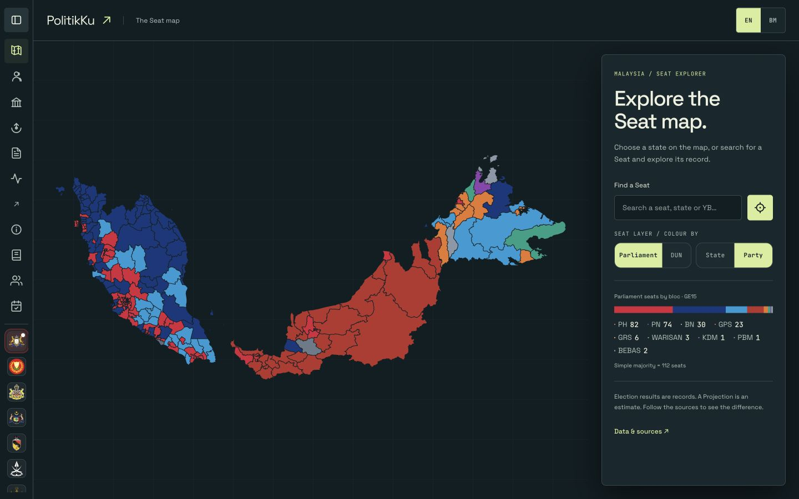
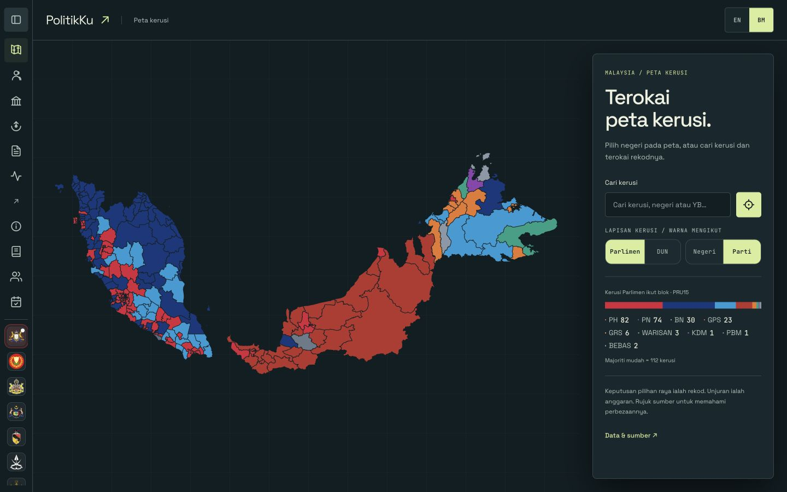

# Seat map observatory preview

Review-only source. Nothing in production loads this directory.

Branch: `codex/app-observatory-preview`.
Base: `45991c1280b6e4b5af62dfa37ff312665b8bfe28`, the freshly fetched
`origin/main` tip when the branch was created on 11 September 2026.
The local `main` was four commits behind and was not used as the branch point.

## Preview locally

From the repository root:

```sh
python3 frontend/observatory-preview/serve.py
```

Open http://127.0.0.1:8766/app/. Use `--port 8767` if that port is occupied.
The server binds only to localhost. It has no dependencies beyond Python's
standard library and writes no generated files. Start it again after editing
`serve.py`; HTML, CSS and JavaScript edits need only a browser refresh.

The preview server serves this directory's `index.html`, `observatory.css` and
`observatory.js` at `/app/`. All other `/app/` requests read the original
`frontend/public/` files. Other paths read the existing `public/` output.
This preserves real route, asset, share-link and iframe paths on an isolated
local origin. Generated share URLs use that local origin, so they are for local
review, not for sharing publicly.

## Production isolation

The actual production step is **Fold frontend/ into the Pages artifact** in
`.github/workflows/daily.yml`, lines 139–146 at the base commit:

```sh
mkdir -p public/app public/fonts
cp -r frontend/public/. public/app/
cp -r frontend/public/fonts/. public/fonts/
```

Prerendering follows; the upload step publishes `public/`. This workflow is
unchanged. Neither `frontend/public/`, `public/`, homepage templates nor Analyst
files were modified. No production loader, build command or default entry point
references this preview. Wiring it into production requires a separate change.

The preview HTML retains every original DOM ID, translation binding and link.
It still loads the original `/app/styles.css` and `/app/app.js`. Its extra
stylesheet changes presentation; its small script translates added labels,
mirrors navigation into the mobile menu, forwards new controls to existing
handlers and keeps the preview theme meta tag aligned. The narrowly scoped
observers avoid patching the production runtime. This preview depends on the
original DOM contract; recheck it when updating the underlying frontend.

## What changed

- Ink `#101e23`, paper-coloured text and lime `#d6ed9a` follow the observatory
  palette. Existing local Space Grotesk replaces the old display face in the UI.
- A desktop overview places the map beside search, filters, visible Coalition
  counts and source access. State and Seat framing keep their existing logic.
- Flat panels and a quiet grid replace the moving decorative background. The
  preview removes the original external `fluid-bg` script and hides its elements.
- New EN/BM copy distinguishes election records from Projections.
- Mobile offers a direct filters button and all eleven navigation destinations
  in text. Card and embed actions are now visible on small-screen Seat details.
- State headings no longer use the animated text clip that overlapped flags.
- The viewport allows browser zoom. Reduced-motion rules and focus styling remain.

Boundary geometry, Coalition colours, results, citations, original translations,
Seat card artwork, PNG generation, image copying, social share formatting,
embed code and widget content remain original. Analyst keeps its existing
English-only label and destination in both navigation variants.

## Verification on 11 September 2026

The original `/app/` was served on port 8765 and exercised before design edits:
sidebar expansion, Selangor → Bangi selection, Seat detail, generated card and
rendered embed preview. Screenshots were reviewed during the walkthrough.

| Function | Check performed in the preview |
| --- | --- |
| Boundary map | Clicked an actual P.001 SVG boundary, opening Perlis. Parliament rendered 222 paths; DUN rendered 613 paths from the unchanged boundary dataset. These are path counts, not a new claim about current DUN Seat totals. |
| State → district | Selangor sidebar → district search → Bangi on desktop; mobile state search → Selangor → district picker → Bangi → More → full Seat detail. Reloaded the P.102 deep link. |
| Filters | Switched Parliament/DUN and State/Party; checked the hash, selected controls, SVG path counts and computed fills. Mobile filters button opens the original controls and focuses the first tab. |
| Card preview | Generated Bangi in EN on mobile and BM on desktop, inspecting rendered image content. |
| PNG download | Clicked Download PNG; confirmed `politikku-P.102.png` in Downloads, 807,583 bytes. The browser automation download event timed out, but the actual file arrived. |
| Copy image | Clicked Copy image and read an `image/png` clipboard item with nonempty binary content. |
| WhatsApp / X | Clicked both buttons and inspected opened share URLs: Bangi, P.102, Syahredzan Bin Johan, PH, Majority 69,701 and the correct local deep link. Stopped before sending or posting. |
| Embed | Opened desktop BM and mobile EN generators; iframe rendered Bangi. Copy embed code produced the complete iframe string with P.102 and the local `/app/embed.html` path. |
| Navigation | All eleven destinations and translated labels present on desktop and mobile; exercised the new mobile Glossary link through the existing handler. Existing homepage/map navigation also loaded. |
| Sidebar | Confirmed collapsed width 60px and expanded width 232px, with navigation labels returning on expansion. Existing auto-collapse behaviour is retained. |
| Sources | Opened the original About/source panel through the new button. Labels and URLs are unchanged for DOSM, data.gov.my, electiondata.my (Thevesh), SPR, Wikipedia / Wikidata and the krackedmaps projection credit. All six destinations loaded in a web or browser check. |
| Layout / language | Reviewed EN and BM at 1440×900 and 390×844, plus the intermediate 842px browser width. Inspected saved screenshots. Checked actual body background and theme meta value as `#101e23`. |
| Isolation | Diff against the base is empty for `.github/workflows/daily.yml`, `frontend/public/`, `src/` and tracked `public/`. HTML inventory preserved 108 original IDs, 22 original anchors and 104 translation bindings, with no duplicate IDs. |

Mechanical checks:

- `.venv/bin/pytest`: **647 passed, 9 deselected**. The repository's default
  configuration excludes tests marked `model` or `network`. First sandboxed run
  failed only the local HTTP-server test; rerun with localhost access passed.
- `node --test frontend/public/lib.test.mjs`: **125 passed**.
- `.venv/bin/ruff check`: passed.
- `.venv/bin/mypy`: passed, 40 source files.
- Explicit Ruff check of this directory's `serve.py`: passed.
- `node --check frontend/observatory-preview/observatory.js`: passed.
- `git diff --check`: passed.

Limits: no social post was sent; no device geolocation permission was requested.
The original widget renders BM even when opened from the EN app, observed before
and after this work; its language behaviour was not changed. Two independent
reviewers were dispatched but both failed on account quota before returning a
review. The final review was completed locally, not independently.

## Screenshots




Other saved views:

- [Mobile EN](screenshots/mobile-en.png)
- [Mobile BM](screenshots/mobile-bm.png)
- [Mobile BM navigation](screenshots/mobile-nav-bm.png)
- [Mobile EN card preview](screenshots/mobile-card-en.png)
- [Mobile embed preview](screenshots/mobile-embed.png)
